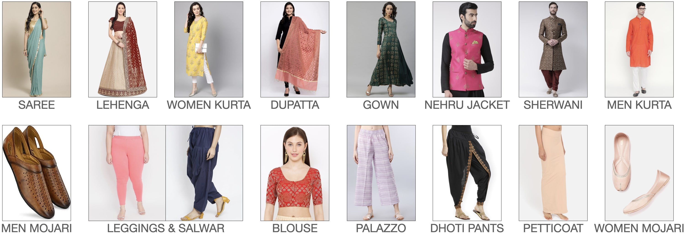

## [IndiaFashion:  Indian Ethnic Apparel Classification model] based on [IndoFashion](https://indofashion.github.io/)

Indiafashion dataset is based on the IndoFashion dataset with an extension of the 3 additional class (Men Pagdi, Women Anarkali Kurta, Women A-Line Kurta). 
To access the augmented [IndiaFashion dataset](https://drive.google.com/file/d/1wKqmn_K6HoiUuvP038PN5cpAHQOrIPZ5/view?usp=sharing)
To access original IndoFashion dataset you can contact original authors of [IndoFashion](https://github.com/IndoFashion/IndoFashion)

<p float="left">
   
</p>

<p float="left">
   
</p>


</br>
</br>

## Dataset Description

### Dataset Statistics

The dataset consists of 110K images and 18 unique cloth
categories. For a fair evaluation, we ensure equal distribution of the classes in the validation and the test set consisting of 500 samples per class.
The dataset stats are listed below.

<p align='center'>Table 1: Class Categories.</p>
<table align='center'>

  <tr>
    <td><b>Gender</b></td>
    <td><b>Categories</b></td>
  </tr>
  <tr>
    <td align='center'>Women</td>
    <td align='center'> Saree, Women Kurta, Leggings & Salwar,
Palazzo, Lehenga, Dupatta, Blouse, Gown,
Dhoti Pants, Petticoats, Women Mojari, Women Anarkali Kurta, Women A-Line Kurta</td>
  </tr>
  <tr>
    <td align='center'>Men</td>
    <td align='center'>Men Kurta, Nehru Jacket, Sherwani, Men
Mojari, Men Pagdi</td>

  </tr>
</table>

</br>
</br>

<p align='center'>Table 2: Dataset stats.</p>
<table align='center'>

  <tr>
    <td><b>Split</b></td>
    <td><b># Images</b></td>
  </tr>
  <tr>
    <td align='center'>Train</td>
    <td align='center'> 94,677</td>
  </tr>
  <tr>
    <td align='center'>Valid</td>
    <td align='center'>7,809</td>

  </tr>
  <tr>
    <td align='center'>Test </td>
    <td align='center'>7,808</td>
  </tr>
</table>

</br>

### Data Format

In the Indofashion dataset, training, validation and test sets are provided as JSON (JavaScript Object Notation) text files with the
following attributes for every data sample stored as a dictionary:

File Structure for train.json, val.json and test.json

```
{   "image_url": <image_url>,
    "image_path": <img_path>,
    "brand": <brand_name>,
    "product_title": <product_title>,
    "class_label": <class_label>
}
```

</br>
</br>

<p align='center'>Table 2: Attributes in Train/Validation,Test files.</p>

| Key   | Description                                                                      |
| -------- | ------------------------------------------------------------------------------|
| `image_url`    | URL used to download the image                     | 
| `image_path`          | Source path in dataset directory for the image                  |
| `brand`           | Brand name of the product                          |
| `product_title`       | Brief description of the product                           |
| `class_label`  | Label of the product                           |

</br>

*In cases where any of these attributes are not present, we substitute them with NA.


</br>

## Getting started

1. **Source Code:**   `$ git clone` this repo and install the Python dependencies from `requirements.txt`
2. **Dataset** Download can be downloaded from [IndoFashion](https://github.com/IndoFashion/IndoFashion)
3. **Train** You can upload "src/Jupyter_Notebook/IndoF.ipynb" jupyter notebook file to google colaboratory and can train and test the model.

from google.colab import drive
drive.mount('/content/drive')


!unzip drive/My\ Drive/IndoFashion.zip -d IndoFashion


!unzip drive/My\ Drive/IndoFashionDataset.zip -d IndoFashionDataset


!python /content/IndoFashion/img_trainer.py -m train -a resnet50


!python /content/IndoFashion/img_trainer.py -m test --model_name my_model -a resnet50


Saving the model
from google.colab import files

# Define the path to the model file in Colab environment
colab_model_path = "/content/IndoFashion/models/my_model.pt"

# Download the model file
files.download(colab_model_path)


4. **Test** The pretrained checkpoints can be downloaded and are available [here](https://drive.google.com/file/d/1HhZbUC4TjRtX2sNqXTzdCqIRCM6CY3Mi/view?usp=sharing)

</br>


## Contact Us

For any queries, please email us at sachinkumarpatel1996@gmail.com. We will try to respond 
as soon as possible.
